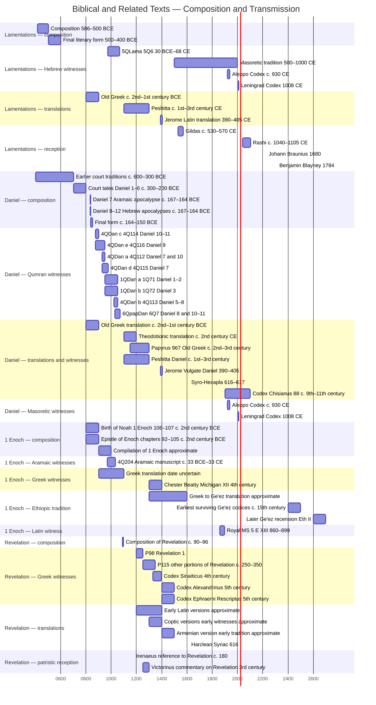

```mermaid

gantt
    title Biblical and Related Texts — Composition and Transmission
    dateFormat YYYY
    axisFormat %Y

    section Lamentations — composition
    Composition 586–500 BCE :lamcomp, 0415, 0501
    Final literary form 500–400 BCE :lamfinal, 0501, 0601

    section Lamentations — Hebrew witnesses
    5QLama 5Q6 30 BCE–68 CE :lam5q, 0971, 1068
    Masoretic tradition 500–1000 CE :lammt, 1500, 2000
    Aleppo Codex c. 930 CE :lamaleppo, 1920, 1940
    Leningrad Codex 1008 CE :lamlen, 2008, 2009

    section Lamentations — translations
    Old Greek c. 2nd–1st century BCE :lamog, 0801, 0901
    Peshitta c. 1st–3rd century CE :lampesh, 1100, 1300
    Jerome Latin translation 390–405 CE :lamvulg, 1390, 1405

    section Lamentations — reception
    Gildas c. 530–570 CE :lamgildas, 1530, 1570
    Rashi c. 1040–1105 CE :lamrashi, 2040, 2105
    Johann Braunius 1680 :lambraun, 2680, 2681
    Benjamin Blayney 1784 :lamblay, 2784, 2785

    section Daniel — composition
    Earlier court traditions c. 600–300 BCE :dancourt, 0401, 0701
    Court tales Daniel 1–6 c. 300–200 BCE :dantales, 0701, 0801
    Daniel 7 Aramaic apocalypse c. 167–164 BCE :dan7, 0834, 0837
    Daniel 8–12 Hebrew apocalypses c. 167–164 BCE :dan812, 0834, 0837
    Final form c. 164–150 BCE :danfinal, 0837, 0851

    section Daniel — Qumran witnesses
    4QDan c 4Q114 Daniel 10–11 :dan114, 0876, 0901
    4QDan e 4Q116 Daniel 9 :dan116, 0876, 0951
    4QDan a 4Q112 Daniel 7 and 10 :dan112, 0926, 0951
    4QDan d 4Q115 Daniel 7 :dan115, 0926, 0976
    1QDan a 1Q71 Daniel 1–2 :dan171, 0951, 1051
    1QDan b 1Q72 Daniel 3 :dan172, 0951, 1051
    4QDan b 4Q113 Daniel 5–8 :dan113, 1020, 1050
    6QpapDan 6Q7 Daniel 8 and 10–11 :dan67, 1030, 1070

    section Daniel — translations and witnesses
    Old Greek translation c. 2nd–1st century BCE :danog, 0801, 0901
    Theodotionic translation c. 2nd century CE :dantheo, 1100, 1200
    Papyrus 967 Old Greek c. 2nd–3rd century :dan967, 1150, 1300
    Peshitta Daniel c. 1st–3rd century :danpesh, 1100, 1300
    Jerome Vulgate Daniel 390–405 :danvulg, 1390, 1405
    Syro-Hexapla 616–617 :dansyro, 1616, 1617
    Codex Chisianus 88 c. 9th–11th century :danchis, 1900, 2100

    section Daniel — Masoretic witnesses
    Aleppo Codex c. 930 CE :danaleppo, 1920, 1940
    Leningrad Codex 1008 CE :danlen, 2008, 2009

    section 1 Enoch — composition
    Birth of Noah 1 Enoch 106–107 c. 2nd century BCE :enochnoah, 0801, 0901
    Epistle of Enoch chapters 92–105 c. 2nd century BCE :enochepistle, 0801, 0901
    Compilation of 1 Enoch approximate :enochcompile, 0901, 1000

    section 1 Enoch — Aramaic witnesses
    4Q204 Aramaic manuscript c. 33 BCE–33 CE :enocharamaic, 0968, 1033

    section 1 Enoch — Greek witnesses
    Greek translation date uncertain :enochgreek, 0901, 1101
    Chester Beatty Michigan XII 4th century :enochcbm, 1301, 1400

    section 1 Enoch — Ethiopic tradition
    Greek to Ge'ez translation approximate :enochgeeztrans, 1301, 1600
    Earliest surviving Ge'ez codices c. 15th century :enochgeez, 2400, 2500
    Later Ge'ez recension Eth II :enochethii, 2600, 2700

    section 1 Enoch — Latin witness
    Royal MS 5 E XIII 860–899 :enochroyal, 1860, 1899

    section Revelation — composition
    Composition of Revelation c. 90–96 :revcomp, 1090, 1096

    section Revelation — Greek witnesses
    P98 Revelation 1:13–20 c. 200–250 :revp98, 1200, 1250
    P115 other portions of Revelation c. 250–350 :revp115, 1250, 1350
    Codex Sinaiticus 4th century :revsin, 1330, 1399
    Codex Alexandrinus 5th century :revalex, 1400, 1499
    Codex Ephraemi Rescriptus 5th century :reveph, 1400, 1499

    section Revelation — translations
    Early Latin versions approximate :revlatin, 1200, 1400
    Coptic versions early witnesses approximate :revcoptic, 1300, 1400
    Armenian version early tradition approximate :revarmenian, 1400, 1500
    Harclean Syriac 616 :revharclean, 1616, 1617

    section Revelation — patristic reception
    Irenaeus reference to Revelation c. 180 :revirenaeus, 1180, 1181
    Victorinus commentary on Revelation 3rd century :revvictor, 1250, 1300

```
